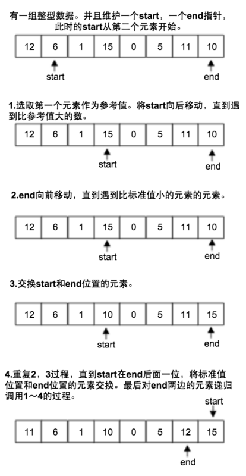
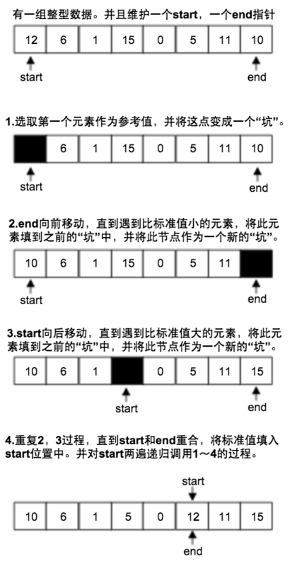
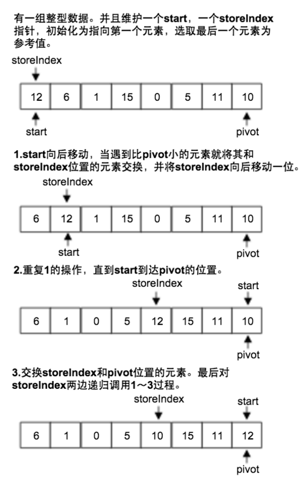
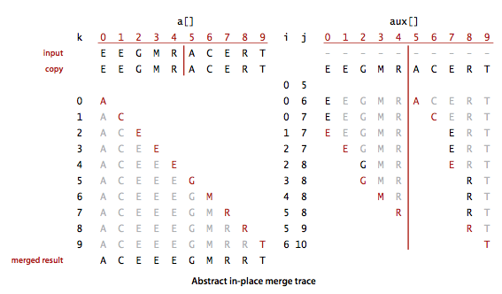
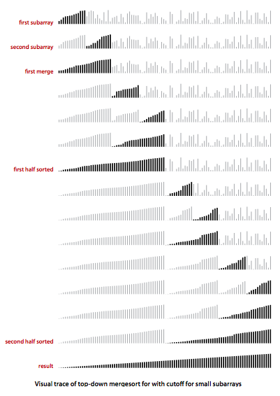
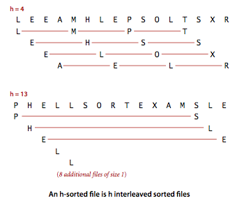

排序算法是最基础的算法知识，程序员必掌握，这里主要参考了[算法第四版](https://algs4.cs.princeton.edu/home/)这本书，比较详细的讲解了各种排序算法的实现方式及区别

---

##  常用排序算法区别分析

### 总览


### 实现原理

- 插入排序

  将右部无序部分的数依次通过邻近交换插入到左部有序部分中合适的位置处

- 希尔排序

  对由不同固定间隔的元素组成的序列进行插入排序，间隔由某个数一直除到1，使数组中任意间隔为h的元素都是有序的

- 选择排序

  将右部无序部分的最小值依次通过直接交换选择到左部末尾形成有序部分

- 冒泡排序

  将左部无序部分的最大值依次通过邻近交换冒泡到右部开头形成有序部分

- 快速排序

  将数组递归地切分成左右两部分，小数放在左边，大数放在右边

- 归并排序

  将数组递归地切分成左右两部分，再对左右部分进行归并

- 堆排序

  先通过下沉(遍历二叉树使父节点大于子节点)构造一个完全二叉树，再通过交换和下沉进行下沉排序操作

### 比较次数

- 插入排序

  n-1次 ～ n(n-1)/2次

- 希尔排序

  不确定，与序列间隔数选取有关

- 选择排序

  恒定为O(n^2)

- 冒泡排序

  恒定为 n(n-1)/2

- 快速排序

  O(nlogN) ~ O(n^2)

- 归并排序

  nlogn次

- 堆排序

  NlogN 较稳定 ，接近于归并排序的比较次数

### 移动次数

- 插入排序

  0次 ～ n(n-1)/2次

- 希尔排序

  不确定，与初始顺序有关

- 选择排序

  数据移动最少的排序算法，n次线性级别,最多交换n-1次

- 冒泡排序

  初始顺序的逆序数

- 快速排序

  O(nlogN) ~ O(n^2)

- 归并排序

  nlogn次

- 堆排序

  不确定，与初始顺序有关

### 时间复杂度

- 插入排序 o(n) ~ O(n^2)

  - 对于最好情况，即数组已有序的情况：

    插入排序内循环是将当前元素与左边有序部分的元素比较，若原数组有序，即任何左边元素都小于右边元素，内循环只需要做一次判断即可退出内循环

- 希尔排序 O(n^1.3)

  - 对于最坏情况，即每个不同间隔的序列都为倒序，对倒序进行插入排序：

    第1、2、3次不同间隔的序列比较，每组序列分别为2 、4 、8个元素

    最坏情况下的时间复杂度小于O(n^2)

- 选择排序 O(n^2) ~ O(n^2)

  - 对于最好情况，即数组已有序的情况：

    选择排序每次都要内循环选最小的值，即使当期元素已经是最小值

- 冒泡排序 O(n) ~ O(n^2)

  - 对于最好情况，即数组已有序的情况：

    只需要外循环遍历一次，执行完内循环发现已有序即可退出

- 快速排序 O(NlogN)~o(n^2)

  - 对于最好情况，即每一次选取key都能将当前数组部分对半分：

    log2N次的切分操作和n/x次的交换大小数操作

  - 对于最坏情况，即每一次选取key都是当前数组部分的最小值或最大值：

    n/2次的切分操作和n/x次的交换大小数操作

- 归并排序 O(NlogN)

  - 执行次数恒定为NlogN：

    log2N次的切分操作和n/2次的归并操作

- 堆排序 O(NlogN)

  - 堆排序的平均时间复杂度：

    n次堆的构造和logN次下沉排序
    
  - 对于最坏情况，即比较次数最大的情况：
  
    堆排序也能保证使用2NlgN的比较次数

### 空间复杂度

- 插入排序 O(1)

- 希尔排序 O(1)

- 选择排序 O(1)

- 冒泡排序 O(1)

- 快速排序 O(logN)

  辅助空间为常数，空间复杂度等于递归调用深度

- 归并排序 O(N)

- 堆排序 O(1)

关于不同排序算法对于空间复杂度的要求不同，可查看以下例子：

- [七、调整数组顺序，奇数位于前面](https://humingk.github.io/algorithms-program_array/#七调整数组顺序奇数位于前面) 类快速排序 / 另建数组 / 类插入排序 / 类冒泡排序

  要求稳定性、空间复杂度

### 稳定性

稳定性定义：

若排序前后两个相等的数相对位置不变，则算法稳定。

- 插入排序 稳定

  插入排序是将无序部分的数依次插入到左部有序部分中，插入操作是通过**邻近元素交换**

- 希尔排序 不稳定

  对由不同固定间隔的元素组成的序列进行插入排序，虽然相对于每组序列来说是稳定的，但不同的序列多次进行插入排序，变得不稳定

- 选择排序 不稳定

  选择排序是将当期无序部分的最小值依次移到左部形成有序部分，选择操作是通过**直接和最小值交换**

- 冒泡排序 稳定

  冒泡排序是将当前无序部分的最大值依次移到右部形成有序部分，冒泡操作是通过**邻近元素交换**

- 快速排序 不稳定

  在把小数放左边、大数放右边后，key需要和当前的左右相遇值进行交换，这样会打乱左边部分的稳定性

- 归并排序 稳定

  递归切分到左右只有一个元素，排序也就只是**邻近元素交换**,而且归并两个已排序的数组也不会破坏稳定性

- 堆排序 不稳定

  堆排序的不稳定发生在，如果有两个相等的元素连续，而第二个相等的元素在进行下沉排序的时候可能被交换到父节点，即第一个相等的元素的前面


关于不同排序算法对于稳定性的要求不同，可查看以下例子：

- [七、调整数组顺序，奇数位于前面](https://humingk.github.io/algorithms-program_array/#七调整数组顺序奇数位于前面) 类快速排序 / 另建数组 / 类插入排序 / 类冒泡排序

  要求稳定性、空间复杂度

###  优缺点

- 插入排序
  - 优点：相对位置稳定 / 越有序的数组越快 / 不需要辅助空间
  - 缺点：时间不稳定 / 慢 / 最差情况时间复杂度为O(n^2)
- 希尔排序
  - 优点：数组越大越快 / 最差情况时间复杂度也不会超过O(n^2)
  - 缺点：相对位置不稳定 / 效率很大取决于序列间隔最优取值而且不确定
- 选择排序
  - 优点：数据移动最少的排序算法，N次的线性交换次数 / 时间复杂度固定为O(n^2)
  - 缺点：相对位置不稳定 / 慢 / 最好情况时间复杂度都是O(n^2)
- 冒泡排序
  - 优点：相对位置稳定
  - 缺点：最差情况时间复杂度为O(n^2) / 慢
- 快速排序
  - 优点：最快的排序算法
  - 缺点：相对位置不稳定 / 需要辅助空间O(logN) / 最差情况时间复杂度为O(n^2)
- 归并排序
  - 优点：相对位置稳定 / 时间复杂度固定为O(NlogN)
  - 缺点：需要辅助空间O(n)
- 堆排序
  - 优点：唯一最优地利用时间和空间的排序算法 / 时间复杂度为O(NlogN) / 比较次数少
  - 缺点：相对位置不稳定 / 需要建堆 / 无法利用缓存，很少相邻数据比较，缓存命中率低

### 适用类型

- 插入排序

  适用于要求相对位置不变且初始比较有序的数组

- 希尔排序

  适用于大数组

- 选择排序

  适用于小数组,或者要求时间复杂度固定为O(n^2)

- 冒泡排序

  适用于要求相对位置不变的数组

- 快速排序

  适用于对速度有比较高的要求的数组

  适用于重复元素比较多的数组(三向切分快速排序)

- 归并排序

  适用于要求相对位置不变且可以用辅助空间的数组，或者要求时间复杂度固定为O(NlogN)

- 堆排序

  适用于大数组，排序前需要构造堆
  
  适用于比较操作代价高的数组，比如字符串类型的元素

---


## 一、堆排序

- 堆排序是唯一能够同时最优地利用空间和时间的方法，适合大数据操作（递归调用较多）
- 堆排序无法利用缓存，数组元素很少和相邻的元素比较，因此缓存未命中次数远远高于其他排序算法

先构造一个父节点大于子节点的完全二叉树，再进行下沉排序

### 比较次数 NlogN 较稳定 较少

下沉排序总是将最大值直接放到堆底然后上浮，可以将比较次数减少一半

其比较次数甚至接近归并排序所需要的比较次数

### 移动次数 不确定

堆排序的移动次数与初始顺序有关

### 稳定性 不稳定

堆排序的不稳定发生在，如果有两个相等的元素连续，而第二个相等的元素在进行下沉排序的时候可能被交换到父节点，即第一个相等的元素的前面

eg：

9 5' 7 5

第一次下沉排序的交换：

5 5' 7 9

第一次下沉排序的下沉：

7 5' 5 9

第二次下沉排序的交换：

5 5' 7 9

可见，在第二次下沉排序的交换操作中，5'和5连续，但5被交换到父节点，即5'的前面，破坏了稳定性

### 时间复杂度 O(NlogN)

n次堆的构造和logN次下沉排序

最坏情况下也能保证2NlgN的比较

### 空间复杂度 O(1)

### sink

sink规则：

- 根节点>子节点
- 从最后一个含有子节点的节点(N/2)开始倒序遍历进行sink

```java
    private static void sink(Comparable[] a, int k, int N) {
        while (2 * k <= N) {
            int j = 2 * k;
            //左节点小于右节点，遍历到右节点
            if (j < N && less(a, j, j + 1)) {
                j++;
            }
            //根节点大于子节点
            if (!less(a, k, j)) {
                break;
            }
            //根节点小于子节点，交换
            exch(a, k, j);
            k = j;
        }
    }
```

### 堆的构造 O(n)

从右到左调用sink()构造子堆,使其堆有序(父节点>子节点)，最大值位于根节点

```java
        //构造堆
        for (int k = N / 2; k >= 1; k--) {
            sink(a, k, N);
        }
```

### 下沉排序 O(logN)

将堆中最大元素（根节点）删除，放入堆缩小后数组中空出来的位置

```java
        //下沉排序
        while (N > 1) {
            exch(a, 1, N--);
            sink(a, 1, N);
        }
```


### 完整代码

```java
package sort;

/**
 * 堆排序
 *
 * @author humingk
 */
public class Heap {
    public static void sort(Comparable[] a) {
        int N = a.length;
        //构造堆
        for (int k = N / 2; k >= 1; k--) {
            sink(a, k, N);
        }
        //下沉排序
        while (N > 1) {
            exch(a, 1, N--);
            sink(a, 1, N);
        }
    }

    /**
     * 下沉
     * 根节点>子节点
     *
     * @param a
     * @param k
     * @param N
     */
    private static void sink(Comparable[] a, int k, int N) {
        while (2 * k <= N) {
            int j = 2 * k;
            //左节点小于右节点，遍历到右节点
            if (j < N && less(a, j, j + 1)) {
                j++;
            }
            //根节点大于子节点
            if (!less(a, k, j)) {
                break;
            }
            //根节点小于子节点，交换
            exch(a, k, j);
            k = j;
        }
    }

    //如果v<w,返回true
    private static boolean less(Comparable[] a, int i, int j) {
        return a[i - 1].compareTo(a[j - 1]) < 0;
    }

    private static void exch(Comparable[] a, int i, int j) {
        Comparable t = a[i - 1];
        a[i - 1] = a[j - 1];
        a[j - 1] = t;
    }

    private static void show(Comparable[] a) {
        for (int i = 0; i < a.length; i++) {
            System.out.print((a[i] + " "));
        }
        System.out.println();
    }

    public static boolean isSorted(Comparable[] a) {
        for (int i = 1; i < a.length; i++) {
            if (less(a, ++i, i)) {
                return false;
            }
        }
        return true;
    }

    public static void main(String[] args) {
        String[] a = {"S", "O", "R", "T", "E", "X", "A", "M", "P", "L", "E"};
        sort(a);
        assert isSorted(a) : "wrong";
        show(a);
    }
}
```

## 二、快速排序

将一个数组分成两个子数组，小的数放在左边，大的数放到右边

1. 先从数列中取出一个数作为key值
2. 将比这个数小的数全部放在它的左边，大于或等于它的数全部放在它的右边
3. 对左右两个小数列重复第二步，直至各区间只有1个数

为了切分的时候尽量切到中间值，排序前可随机打乱初始顺序

### 比较次数 O(nlogN) ~ O(n^2)


### 移动次数 O(nlogN) ~ O(n^2)


### 稳定性 不稳定

在把小数放左边、大数放右边后，key需要和当前的左右相遇值进行交换，这样会打乱左边部分的稳定性

### 时间复杂度 O(NlogN)~o(n^2)

快速排序的最好情况是每次都能将数组对半分，O(NlogN)

最坏情况是每次选取的元素都最大或最小，O(NlogN)~o(n^2)

### 空间复杂度 O(logN)

辅助空间为常数，空间复杂度等于递归调用深度

### 排序 - 先切分再左右递归

```java
		//减少切分不平衡的影响
        StdRandom.shuffle(a);
        if (lo >= hi)
            return;
		//j为切分值替换的位置
        int j = partition(a, lo, hi);
        sort(a, lo, j - 1);
        sort(a, j + 1, hi);
```


### 切分 - 默认第一个为key

```java
    private static int partition(Comparable[] a, int lo, int hi) {
        int i = lo, j = hi + 1;
        Comparable v = a[lo];
        while (true) {
            // 从前向后，若当前元素大于v，则需要换到右边
            while (i < hi && less(a[++i], v)) ;
            // 从后向前,若当前元素小于v，则需要换到左边
            while (j > lo && less(v, a[--j])) ;
            if (i >= j) {
                break;
            }
            // ij交换
            exch(a, i, j);
        }
        //前后相遇处替换为 v
        exch(a, lo, j);
        return j;
    }
```

### 切分 - 自定义key

```javascript
    private static int partition(Comparable[] a, int lo, int hi,int k) {
        int i = lo, j = hi + 1;
        // 将k元素换到开头
        exch(a,lo,k);
        Comparable v = a[lo];
        while (true) {
            // 从前向后，若当前元素大于v，则需要换到右边
            while (i < hi && less(a[++i], v)) ;
            // 从后向前,若当前元素小于v，则需要换到左边
            while (j > lo && less(v, a[--j])) ;
            if (i >= j) {
                break;
            }
            // ij交换
            exch(a, i, j);
        }
        //前后相遇处替换为 v
        exch(a, lo, j);
        return j;
    }    
```


### 快速排序中切分的四种方式

#### 1. 交换法（上述采用方法）

左右元素进行交换



#### 2. 填坑法

key元素作为一个坑，右边遍历比key小的，左边遍历比key大的，都与坑交换



#### 3. 顺序遍历法

1和2都是前后向中间遍历,此处顺序遍历



#### 4. 排序+切分一体

```java
    private static void sort(Comparable[] a, int lo, int hi) {
        if (lo >= hi) {
            return;
        }
        int lt=lo,gt=hi,i=lo+1;
        Comparable v=a[lo];
        while (i<=gt){
            int cmp=a[i].compareTo(v);
            if(cmp<0) {
                exch(a,lt++,i++);
            } else if(cmp>0) {
                exch(a,i,gt--);
            } else {
                i++;
            }
        }
        show(a);
        sort(a, lo, lt - 1);
        sort(a, gt + 1, hi);
    }
```

### 完整代码

```java
package sort;

/**
 * 快速排序
 *
 * @author humingk
 */
public class Quick {
    public static void sort(Comparable[] a) {
//        StdRandom.shuffle(a);
        sort(a, 0, a.length - 1);
    }

    private static void sort(Comparable[] a, int lo, int hi) {
        if (lo >= hi) {
            return;
        }
        //j为切分值替换的位置
        int j = partition(a, lo, hi);
        sort(a, lo, j - 1);
        sort(a, j + 1, hi);
    }

    /**
     * 1. 交换法
     *
     * @param a
     * @param lo
     * @param hi
     * @return
     */
    private static int partition(Comparable[] a, int lo, int hi) {
        int i = lo, j = hi + 1;
        Comparable v = a[lo];
        while (true) {
            // 从前向后，若当前元素大于v，则需要换到右边
            while (i < hi && less(a[++i], v)) ;
            // 从后向前,若当前元素小于v，则需要换到左边
            while (j > lo && less(v, a[--j])) ;
            if (i >= j) {
                break;
            }
            // ij交换
            exch(a, i, j);
        }
        //前后相遇处替换为 v
        exch(a, lo, j);
        return j;
    }

    //如果v<w,返回true
    private static boolean less(Comparable v, Comparable w) {
        return v.compareTo(w) < 0;
    }

    private static void exch(Comparable[] a, int i, int j) {
        Comparable t = a[i];
        a[i] = a[j];
        a[j] = t;
    }

    private static void show(Comparable[] a) {
        for (int i = 0; i < a.length; i++) {
            System.out.print((a[i] + " "));
        }
        System.out.println();
    }

    public static boolean isSorted(Comparable[] a) {
        for (int i = 1; i < a.length; i++) {
            if (less(a[i], a[i - 1])) {
                return false;
            }
        }
        return true;
    }

    public static void main(String[] args) {
//        String[] a = {"S", "O", "R", "T", "E", "X", "A", "M", "P", "L", "E"};
        String[] a = {"1", "2", "3", "2", "2", "2", "5", "4", "2"};
        sort(a);
        assert isSorted(a) : "wrong";
        show(a);
    }
}
```

### 快速排序优化之三向切分

对于有很多重复的元素，排序到一定程度本应该已有序，停止排序的，但快速排序仍会继续将重复的元素部分继续切分成更小的部分

这时可以考虑将数组分为三部分：

- 左边部分小于切分值
- 中间部分等于切分值
- 右边部分大于切分值

递归切分的时候，分别递归左边部分和右边部分即可，中间部分均为重复值且已经有序

#### 排序+切分

```java
    private static void sort(Comparable[] a, int lo, int hi) {
        if (lo >= hi) {
            return;
        }
        // i部分为中间部分，为与当前v相等的元素
        int lt = lo, gt = hi, i = lo + 1;
        Comparable v = a[lo];
        while (i <= gt) {
            // 当前元素小于v
            if (less(a[i], v)) {
                exch(a, lt++, i++);
            }
            // 当前元素大于v
            else if (less(v, a[i])) {
                exch(a, i, gt--);
            }
            // 当前元素与v相等
            else {
                i++;
            }
        }
        show(a);
        // 递归归并的时候跳过i部分
        sort(a, lo, lt - 1);
        sort(a, gt + 1, hi);
    }
```

#### 完整代码

```java
package sort;

import edu.princeton.cs.algs4.StdRandom;

public class Quick3way {
    public static void sort(Comparable[] a) {
        StdRandom.shuffle(a);
        show(a);
        sort(a, 0, a.length - 1);
    }

    /**
     * @param a
     * @param lo
     * @param hi
     */
    private static void sort(Comparable[] a, int lo, int hi) {
        if (lo >= hi) {
            return;
        }
        // i部分为中间部分，为与当前v相等的元素
        int lt = lo, gt = hi, i = lo + 1;
        Comparable v = a[lo];
        while (i <= gt) {
            // 当前元素小于v
            if (less(a[i], v)) {
                exch(a, lt++, i++);
            }
            // 当前元素大于v
            else if (less(v, a[i])) {
                exch(a, i, gt--);
            }
            // 当前元素与v相等
            else {
                i++;
            }
        }
        show(a);
        // 递归归并的时候跳过i部分
        sort(a, lo, lt - 1);
        sort(a, gt + 1, hi);
    }


    //如果v<w,返回true
    private static boolean less(Comparable v, Comparable w) {
        return v.compareTo(w) < 0;
    }

    private static void exch(Comparable[] a, int i, int j) {
        Comparable t = a[i];
        a[i] = a[j];
        a[j] = t;
    }

    private static void show(Comparable[] a) {
        for (int i = 0; i < a.length; i++) {
            System.out.print((a[i] + " "));
        }
        System.out.println();
    }

    public static boolean isSorted(Comparable[] a) {
        for (int i = 1; i < a.length; i++) {
            if (less(a[i], a[i - 1])) {
                return false;
            }
        }
        return true;
    }

    public static void main(String[] args) {
        String[] a = {"T", "T", "T", "T", "T", "D", "D", "S", "X", "X", "O", "O", "P", "P", "P", "P", "O", "R", "T", "E", "X", "A", "M", "P", "L", "E"};
        sort(a);
        assert isSorted(a) : "wrong";
        show(a);
    }
}

```

---

## 三、归并排序

递归地将数组切分成两半，左右部分依次排序，然后将左边和右边进行归并操作

当切分成左右各只有一个元素的时候，左右部分就可以认为分别有序了

### 比较次数 nlogn次

具体来说是：(nlog2n)/2 次 ～ nlog2n-n+1 次

- 最好情况，每一次归并都要比较一半的值，另一半最后再叠加上：

  第一次归并，每次合并两个长度为1的数组，每次比较1次，有n/2次归并，比较n/2次

  第二次归并，每次合并两个长度为2的数组，每次比较2次，有n/4次归并，比较2n/4次

  第三次归并，每次合并两个长度为4的数组，每次比较4次，有n/8次归并，比较4n/8次

- 最差情况，每一次归并都要依次比较所有值，同时遍历完：

  第一次归并，每次合并两个长度为1的数组，每次比较1次，有n/2次归并，比较n/2次

  第二次归并，每次合并两个长度为2的数组，每次比较3次，有n/4次归并，比较3n/4次

  第三次归并，每次合并两个长度为4的数组，每次比较7次，有n/8次归并，比较7n/8次

### 移动次数

由于是用了辅助空间，故移动次数和比较次数一样

### 稳定性 稳定

递归切分到左右只有一个元素，排序也就只是**邻近元素交换**,而且归并两个已排序的数组也不会破坏稳定性

### 时间复杂度 O(Nlog2 N)

1. 排序递归调用，O(logN)
2. 每一次递归调用的时候需要合并，O(N)

### 空间复杂度 O(N)

相同大小的辅助空间

### 归并

左右部分均有序，同步遍历

```java
    private static void merge(Comparable[] a, Comparable[] aux, int lo, int mid, int hi) {
        int i = lo, j = mid + 1;
        // a 复制到 aux
        for (int k = lo; k <= hi; k++) {
            aux[k] = a[k];
        }
        for (int k = lo; k <= hi; k++) {
            //i 过界，取剩下的 j / j对应最小
            if (i > mid || (j <= hi && !less(aux[i], aux[j]))) {
                a[k] = aux[j++];
            }
            //j 过界，取剩下的 i / i对应最小
            else if (j > hi || (i <= mid && less(aux[i], aux[j]))) {
                a[k] = aux[i++];
            }
        }
    }
```



### 排序

```java
        if(hi<=lo) return;
        int mid=lo+(hi-lo)/2;
        //左边排序
        sort(a,aux,lo,mid);
        //右边排序
        sort(a,aux,mid+1,hi);
        //归并
        merge(a,aux,lo,mid,hi);
```



### 完整代码

```java
package sort;

/**
 * 归并排序
 *
 * @author humingk
 */
public class Merge {
    private static Comparable[] aux;

    private static void merge(Comparable[] a, Comparable[] aux, int lo, int mid, int hi) {
        int i = lo, j = mid + 1;
        // a 复制到 aux
        for (int k = lo; k <= hi; k++) {
            aux[k] = a[k];
        }
        for (int k = lo; k <= hi; k++) {
            //i 过界，取剩下的 j / j对应最小
            if (i > mid || (j <= hi && !less(aux[i], aux[j]))) {
                a[k] = aux[j++];
            }
            //j 过界，取剩下的 i / i对应最小
            else if (j > hi || (i <= mid && less(aux[i], aux[j]))) {
                a[k] = aux[i++];
            }
        }
    }

    public static void sort(Comparable[] a) {
        aux = new Comparable[a.length];
        sort(a, aux, 0, a.length - 1);
    }

    private static void sort(Comparable[] a, Comparable[] aux, int lo, int hi) {
        if (hi <= lo) {
            return;
        }
        int mid = lo + (hi - lo) / 2;
        //左边排序
        sort(a, aux, lo, mid);
        //右边排序
        sort(a, aux, mid + 1, hi);
        //归并
        merge(a, aux, lo, mid, hi);
    }

    //如果v<w,返回true
    private static boolean less(Comparable v, Comparable w) {
        return v.compareTo(w) < 0;
    }

    private static void exch(Comparable[] a, int i, int j) {
        Comparable t = a[i];
        a[i] = a[j];
        a[j] = t;
    }

    private static void show(Comparable[] a) {
        for (int i = 0; i < a.length; i++) {
            System.out.print((a[i] + " "));
        }
        System.out.println();
    }

    public static boolean isSorted(Comparable[] a) {
        for (int i = 1; i < a.length; i++) {
            if (less(a[i], a[i - 1])) {
                return false;
            }
        }
        return true;
    }

    public static void main(String[] args) {
        String[] a = {"S", "O", "R", "T", "E", "X", "A", "M", "P", "L", "E"};
        sort(a);
        assert isSorted(a) : "wrong";
        show(a);
    }
}
```

## 四、希尔排序

使数组中任意间隔为h的元素都是有序的

对由不同固定间隔的元素组成的序列进行插入排序，间隔由某个数一直除到1

### 相比于插入排序的优点

希尔排序是针对插入排序的优化，希尔排序比插入排序快得多，并且数组越大，优势越大，适合大数组

使数组中任意间隔为H的元素都是有序的，如果H很大，就能将元素移动到很远的地方，为实现更小的H有序创造方便

例如对于最大值位于开头，插入排序只能一步步将最大值传递交换到末尾，而希尔排序能以Ｈ为间隔将最大值交换到末尾

### 比较次数 不确定

与序列间隔选取值有关

### 移动次数 不确定

与初始顺序有关

### 稳定性 不稳定

对由不同固定间隔的元素组成的序列进行插入排序，虽然相对于每组序列来说是稳定的，但不同的序列多次进行插入排序，变得不稳定

### 时间复杂度 O(n^x)

- 若采用　k=2^h　策略，时间复杂度为：O(n^2)
  1. 每个子数组进行插入排序，时间复杂度为　Ｎ^2/k
  2. 共进行ｌｏｇＮ次插入排序

- 若采用　h=3*h+1　，时间复杂度为：O(n^(3/2))

###　空间复杂度  O(1)

### 排序

```java
    public static void sort(Comparable[] a) {
        int h = 1;
        while (h < a.length / 3) {
            h = 3 * h + 1;
        }
        // 对每一个H，用 插入排序 将H个子数组独立地排序
        while (h >= 1) {
            for (int i = 0; i < a.length; i++) {
                for (int j = i; j >= h; j -= h) {
                    if (less(a[j], a[j - h])) {
                        exch(a, j, j - h);
                    }
                    // 当前元素比当前元素的左边元素大，当前元素已在它在左边有序部分中该有的位置
                    else {
                        break;
                    }
                }
            }
            h /= 3;
        }
    }
```



如下图所示，当h=13的时候，分别对以下三个序列进行插入排序：

S P

H L

E E

这三个序列都是以h为间隔

若h=4，分别对以下4个序列进行插入排序（假设未进行h=13的插入排序）：

S L T M

H S E P

E O X L

L R A E


### 完整代码

```java
package sort;

public class Shell {
    public static void sort(Comparable[] a) {
        int h = 1;
        while (h < a.length / 3) {
            h = 3 * h + 1;
        }
        // 对每一个H，用 插入排序 将H个子数组独立地排序
        while (h >= 1) {
            for (int i = 0; i < a.length; i++) {
                for (int j = i; j >= h; j -= h) {
                    if (less(a[j], a[j - h])) {
                        exch(a, j, j - h);
                    }
                    // 当前元素比当前元素的左边元素大，当前元素已在它在左边有序部分中该有的位置
                    else {
                        break;
                    }
                }
            }
            h /= 3;
        }
    }

    //如果v<w,返回true
    private static boolean less(Comparable v, Comparable w) {
        return v.compareTo(w) < 0;
    }

    private static void exch(Comparable[] a, int i, int j) {
        Comparable t = a[i];
        a[i] = a[j];
        a[j] = t;
    }

    private static void show(Comparable[] a) {
        for (int i = 0; i < a.length; i++) {
            System.out.print((a[i] + " "));
        }
        System.out.println();
    }

    public static boolean isSorted(Comparable[] a) {
        for (int i = 1; i < a.length; i++) {
            if (less(a[i], a[i - 1])) {
                return false;
            }
        }
        return true;
    }

    public static void main(String[] args) {
        String[] a = {"S", "O", "R", "T", "E", "X", "A", "M", "P", "L", "E"};
        sort(a);
        assert isSorted(a) : "wrong";
        show(a);
    }
}
```

## 五、插入排序


- 插入排序时间取决于 数组的初始顺序，有序的数组更快

类似于整理桥牌，将乱序中的牌插入已有序的部分

外循环 i 遍历无序序列

内循环 j 遍历序列的0～i包括i的部分，若j小于i，则将当前的j通过邻近交换的方式插入到j该有的位置

排序过程中，前面部分有序，后面部分无序

### 比较次数 n-1次 ～ n(n-1)/2次

- 最好情况下，即原始数组已有序的情况下：

  每一次选择的元素只需要和前面所有已有序元素比较一次，即n-1次

- 最坏情况下，即原始数组倒序的情况下：

  每一次选择的元素需要和前面的所有已有序元素比较一次，即1、2、3...n-1共n(n-1)/2次

### 移动次数 0次 ～ n(n-1)/2次

- 最好情况下，即原始数组已有序的情况下：

  每一次选择的元素不需要移动

- 最坏情况下，即原始数组倒序的情况下：

  每一次选择的元素需要移动到所有已有序元素的前面，即1、2、3...n-1共n(n-1)/2次

### 稳定性 稳定

插入排序是将无序部分的数依次插入到左部有序部分中，插入操作是通过**邻近元素交换**

### 时间复杂度 O(n)~O(n^2)

- 最好情况，对于正序的有序数组，对于本代码情况（有提前的break），仅O(n)

  若原数组有序，即任何左边元素都小于右边元素，内循环只需要做一次判断即可退出内循环

- 最坏情况，对于倒序的有序数组，为Ｏ(n^2)

### 空间复杂度　Ｏ(1)

### 排序

```java
    public static void sort(Comparable[] a) {
        for (int i = 1; i < a.length; i++) {
            for (int j = i; j > 0; j--) {
                if (less(a[j], a[j - 1])) {
                    exch(a, j, j - 1);
                }
                // 若当前不需要交换，则说明j已经到了有序部分该有的位置
                else {
                    break;
                }
            }
        }
    }
```

### 完整代码

```java
package sort;

public class Insertion {
    public static void sort(Comparable[] a) {
        for (int i = 1; i < a.length; i++) {
            for (int j = i; j > 0; j--) {
                if (less(a[j], a[j - 1])) {
                    exch(a, j, j - 1);
                }
                // 若当前不需要交换，则说明j已经到了有序部分该有的位置
                else {
                    break;
                }
            }
        }
    }

    //如果v<w,返回true
    private static boolean less(Comparable v, Comparable w) {
        return v.compareTo(w) < 0;
    }

    private static void exch(Comparable[] a, int i, int j) {
        Comparable t = a[i];
        a[i] = a[j];
        a[j] = t;
    }

    private static void show(Comparable[] a) {
        for (int i = 0; i < a.length; i++) {
            System.out.print((a[i] + " "));
        }
        System.out.println();
    }

    public static boolean isSorted(Comparable[] a) {
        for (int i = 1; i < a.length; i++) {
            if (less(a[i], a[i - 1])) {
                return false;
            }
        }
        return true;
    }

    public static void main(String[] args) {
        String[] a = {"S", "O", "R", "T", "E", "X", "A", "M", "P", "L", "E"};
        sort(a);
        assert isSorted(a) : "wrong";
        show(a);
    }
}
```

## 六、选择排序

外循环 i 遍历序列

内循环 j 不断选择 i 及i之后剩余元素的最小者，每次选出最小值然后与 i 交换

排序过程中，前面部分有序，后面部分无序

### 比较次数 O(n^2) 恒定

即使已经是有序的数组，每次寻找剩余元素的最小值的时候都需要全部比较一遍

### 移动次数 N次 线性 最少

选择排序是数据移动最少的排序算法，是线性的，其他排序算法一般都是线性对数或平方级别

最多交换n-1次

### 稳定性 不稳定

选择排序是将当期无序部分的最小值依次移到左部形成有序部分，选择操作是通过**直接和最小值交换**

### 时间复杂度 O(n^2)

最好情况最坏情况（有序无序）所花时间都一样

### 空间复杂度　Ｏ(1)

### 排序

```java
        for (int i = 0; i <a.length ; i++) {
            int min=i;
            for (int j = i+1; j <a.length ; j++) {
                if(less(a[j],a[min]))
                    min=j;
            }
            exch(a,i,min);
        }
```

### 完整代码

```java
package test.sort;
public class Selection {
    public static void sort(Comparable[] a){
        for (int i = 0; i <a.length ; i++) {
            int min=i;
            for (int j = i+1; j <a.length ; j++) {
                if(less(a[j],a[min]))
                    min=j;
            }
            exch(a,i,min);
        }
    }
    //如果v<w,返回true
    private static boolean less(Comparable v,Comparable w){
        return v.compareTo(w)<0;
    }
    private static void exch(Comparable[]a,int i,int j){
        Comparable t=a[i];
        a[i]=a[j];
        a[j]=t;
    }
    private static void show(Comparable[]a){
        for (int i = 0; i <a.length ; i++) {
            System.out.print((a[i]+" "));
        }
        System.out.println();
    }
    public static boolean isSorted(Comparable[]a){
        for (int i = 1; i <a.length ; i++) {
            if(less(a[i],a[i-1]))
                return false;
        }
        return true;
    }
    public static void main(String[] args) {
        String[]a= {"S","O","R","T","E","X","A","M","P","L","E"};
        sort(a);
        assert isSorted(a);
        show(a);
    }
}
```

## 七、冒泡排序

外循环倒序 i 遍历整个序列

内循环 j 遍历序列的 0～i 部分，每次在无序队列中将相邻的两个数进行比较，小的在前大的在后，直到将当前最大的数移到序列末尾

若内循环没有交换操作，则说明当前已有序

每一次都是将最大的数移向最后，故而得称冒泡排序

排序过程中，前面部分无序，后面部分有序

### 比较次数 n(n-1)/2 恒定

第一次冒泡，相邻元素比较n-1次

第二次冒泡，相邻元素比较n-2次

...

### 移动次数 初始顺序的逆序数

每一次冒泡中只改变相邻的两个元素的位置的时候，即逆序数减1，并不会影响其他元素的逆序关系

### 稳定性 稳定

冒泡排序是将当前无序部分的最大值依次移到右部形成有序部分，冒泡操作是通过**邻近元素交换**

### 时间复杂度 O(N) ~ O(n^2)

最好情况，对于已经有序的序列，在此算法代码情况下，只需要外循环遍历一次，执行所有内循环有flag即可退出，因而为O(n)

最差情况下，为O(n^2)

若为朴素版本的冒泡排序，即没有添加标志位flag，则最好最差均为O(n^2)

### 空间复杂度 O(1)

### 排序

```java
    public static void sort(Comparable[] a) {
        // 标志位
        boolean flag;
        // 外循环
        for (int i = a.length - 1; i >= 0; i--) {
            flag = false;
            for (int j = 0; j < i; j++) {
                if (!less(a[j], a[j + 1])) {
                    exch(a, j, j + 1);
                    flag = true;
                }
            }
            // 只要有一次内循环没有交换，则说明已有序
            if (!flag) {
                return;
            }
        }
    }
```

### 完整代码

```java
package sort;

/**
 * 冒泡排序
 *
 * @author humingk
 */
public class bubble {
    public static void sort(Comparable[] a) {
        // 标志位
        boolean flag;
        // 外循环
        for (int i = a.length - 1; i >= 0; i--) {
            flag = false;
            for (int j = 0; j < i; j++) {
                if (!less(a[j], a[j + 1])) {
                    exch(a, j, j + 1);
                    flag = true;
                }
            }
            // 只要有一次内循环没有交换，则说明已有序
            if (!flag) {
                return;
            }
        }
    }

    //如果v<w,返回true
    private static boolean less(Comparable v, Comparable w) {
        return v.compareTo(w) < 0;
    }

    private static void exch(Comparable[] a, int i, int j) {
        Comparable t = a[i];
        a[i] = a[j];
        a[j] = t;
    }

    private static void show(Comparable[] a) {
        for (int i = 0; i < a.length; i++) {
            System.out.print((a[i] + " "));
        }
        System.out.println();
    }

    public static boolean isSorted(Comparable[] a) {
        for (int i = 1; i < a.length; i++) {
            if (less(a[i], a[i - 1])) {
                return false;
            }
        }
        return true;
    }

    public static void main(String[] args) {
        String[] a = {"S", "O", "R", "T", "E", "X", "A", "M", "P", "L", "E"};
        sort(a);
        assert isSorted(a);
        show(a);
    }
}
```

