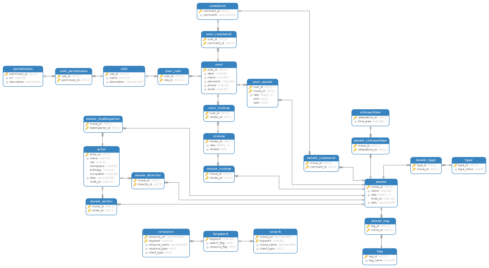
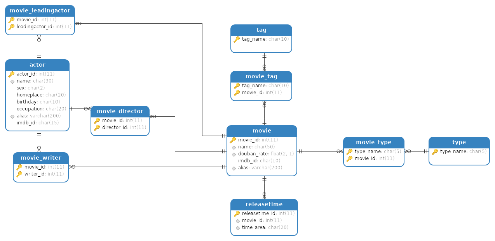

由于以前爬虫获取的豆瓣电影资料库数据库结构考虑不够，导致表之间出现了冗余，这里进行了一系列优化，一方面解决了冗余问题，另一方面也复习了数据库优化知识

---


### 需求分析

- 根据电影ID、电影名获取电影基本信息，导演，编剧，主演，上映时间，分类，标签，IMDB的ID等
- 根据演员ID、演员名获取演员基本信息，参演的电影等
- 根据分类、标签名获取所属的电影列表等
- ...

### 表结构分析

- 基础表

  包括电影表，演员表，标签表，类型表等等

- 关联表

  包括电影-导演表，电影-编剧表，电影-类型表等等

## 电影数据库表结构

### 目前最新版本



### 待优化的历史版本



[最新版SQL](https://humingk.github.io/mysql-douban_movie/#最新版sql)

[历史版SQL](https://humingk.github.io/mysql-douban_movie/#历史版sql)


## 优化过程

### １. 尽可能使用 not null

非null字段的处理比null字段高效,查询的时候不需要判断是否为null

应尽量避免在 where 子句中对字段进行 null 值判断，否则将导致引擎放弃使用索引而进行全表扫描

1. 将字段条件null统统改为not null,默认值从null改为空字符串或0

   `alter TABLE movie MODIFY douban_rate FLOAT(2,1) NOT NULL DEFAULT 0.0;`

2. 将null字段都改为空字符串或者0

   `update actor set imdb_id=ifnull(imdb_id,'');`

3. 重命名一些不合理的字段名称
   `alter TABLE movie change douban_rate rate FLOAT`

### 2. 消除关联表之间的冗余

#### 2.1 movie表 和 tag表 +type表的冗余

- movie_type表中字段为： movie_id, type_name

- type表中字段为：type_name  

明显movie和type两表之间出现数据冗余,  type表应该设置type_id

现更改为 :

- movie_type表字段: movie_id,type_id

- type表字段：type_id,type_name  

1. 先建立一个新表 type1，用于替代type表
```mysql
create table type1(
type_id int NOT NULL auto_increment,
type_name char(5) NOT NULL DEFAULT '',
primary key (type_id),
index type_name(type_name)
)ENGINE=InnoDB DEFAULT charset=utf8mb4
```
2. 将type中的name复制到type1的name
`INSERT INTO type1(type_name) SELECT type_name FROM type;`

3. 建立一个新表 movie_type1，用于替代movie_type表

```mysql
create table movie_type1(
type_id int NOT NULL,
movie_id int NOT NULL,
primary key (type_id,movie_id),
foreign key (movie_id) references movie(movie_id),
foreign key (type_id) references type1(type_id)
) ENGINE=InnoDB DEFAULT charset=utf8mb4
```

4. 将type1表中的type_id 和 movie_type 表中的movie_id 分别复制到 movie_type1 中去
```mysql
INSERT INTO movie_type1(movie_id,type_id)
SELECT movie_type.movie_id,type1.type_id
FROM movie_type,type1
where movie_type.type_name=type1.type_name;
```

5. 删除旧表(注意顺序问题)
`drop table movie_type`
`drop table type`

6. 重命名movie_type1 和 type1
`alter TABLE type1 rename to type;`
`alter TABLE movie_type1 rename to movie_type;`


tag表同上操作


#### 2.2 movie表和releasetime表的冗余

releasetime表中有 movie_id releasetime_id time_area 

movie与releasetime为一对多的关系，这里优化为多对多的关系

1. 建立releasetime1表,用于替代releasetime表
```mysql
create table releasetime1(
releasetime_id int NOT NULL auto_increment,
time_area char(20) NOT NULL DEFAULT '',
index time_area(time_area),
primary key(releasetime_id),
)ENGINE=InnoDB DEFAULT charset=utf8mb4
```

2. 建立movie_releasetime表
```mysql
create table movie_releasetime(
movie_id int NOT NULL,
releasetime_id int NOT NULL,
primary key(movie_id,releasetime_id),
foreign key (movie_id) references movie(movie_id),
foreign key (releasetime_id) references releasetime1(releasetime_id)
)ENGINE=InnoDB DEFAULT charset=utf8mb4
```

3. 清除releasetime中的重复数据

- 查看有哪些重复的元素
```mysql
SELECT * 
from releasetime 
where movie_id in (
select movie_id 
from releasetime 
group by movie_id 
having count(movie_id)>1) 
limit 100;
```

- 发现了大量的重复值,这里清除重复值并保留releasetime_id为最小值的行

注意此处mysql不支持更新数据的时候使用查询以及查询的时候使用更新

故在这里采用嵌套的方式，当然也可以采用另建临时表的方式


```mysql
delete from releasetime
where movie_id
in (
select a.movie_id
from(select movie_id
FROM  releasetime
group by movie_id
having count(movie_id)>3) as a)
and
releasetime_id not in (
select b.releasetime_id
FROM (
select releasetime_id
from releasetime
group by movie_id
having COUNT(movie_id) >3)
as b);
```
4. 将releasetime 中的 releasetime_id 和 time_area 移到新表 releasetime1

```mysql
insert into releasetime1(releasetime_id,time_area) 
SELECT releasetime.releasetime_id,releasetime.time_area 
FROM releasetime;
```

5. 将releasetime中的 movie_id 和 releasetime_id 移到新表 movie_releasetime

```mysql
insert into movie_releasetime(movie_id,releasetime_id) 
SELECT releasetime.movie_id,releasetime.releasetime_id 
FROM releasetime;

```

6. 删除旧表:

`drop table releasetime`

7. 重命名新表:
`alter TABLE releasetime1 rename to releasetime;`

## 总结

通过一系列优化操作，原来54MB的数据库文件现在只有45MB，而且联表查询操作更快了，可见数据库优化的重要性。

刚开始爬虫的时候只顾怎么爬取更多的数据，欠缺对数据库结构的设计规划，导致后期发现了冗余，需要在已有数据上进行优化操作，虽然侥幸优化了一些致命的冗余，但数据库也因此产生了一些小问题(影响也不大，暂且不表)，这种方式实属下策。

正所谓“兵马未动，粮草先行”，数据库就是所谓的“粮草”。


### 最新版SQL

```mysql
#
# 豆瓣电影数据库结构
#
# author:	humingk

# 电影库结构
drop database if exists douban_movie;
create database douban_movie;
use douban_movie;

create table movie
(
    movie_id int          NOT NULL,
    name     char(50)     NOT NULL DEFAULT '',
    rate     float(2, 1)  NOT NULL DEFAULT 0.0,
    imdb_id  char(10)     NOT NULL DEFAULT '',
    alias    varchar(200) NOT NULL DEFAULT '',
    index name (name),
    index douban_rate (rate),
    index alias (alias),
    primary key (movie_id)
) ENGINE = InnoDB
  DEFAULT charset = utf8mb4;

create table type
(
    type_id   int     NOT NULL auto_increment,
    type_name char(5) NOT NULL DEFAULT '',
    primary key (type_id),
    index type_name (type_name)
) ENGINE = InnoDB
  DEFAULT charset = utf8mb4;

create table tag
(
    tag_id   int      NOT NULL auto_increment,
    tag_name char(10) NOT NULL DEFAULT '',
    primary key (tag_id),
    index tag_name (tag_name)
) ENGINE = InnoDB
  DEFAULT charset = utf8mb4;

create table releasetime
(
    releasetime_id int      NOT NULL auto_increment,
    movie_id       int      NOT NULL,
    time_area      char(20) NOT NULL DEFAULT '',
    index time_area (time_area),
    primary key (releasetime_id),
    foreign key (movie_id) references movie (movie_id)
) ENGINE = InnoDB
  DEFAULT charset = utf8mb4;

create table releasetime
(
    releasetime_id int      NOT NULL auto_increment,
    time_area      char(20) NOT NULL DEFAULT '',
    index time_area (time_area),
    primary key (releasetime_id)
) ENGINE = InnoDB
  DEFAULT charset = utf8mb4;

create table actor
(
    actor_id   int          NOT NULL,
    name       char(30)     NOT NULL DEFAULT '',
    sex        char(2)      NOT NULL DEFAULT '',
    homeplace  char(20)     NOT NULL DEFAULT '',
    birthday   char(10)     NOT NULL DEFAULT '',
    occupation char(20)     NOT NULL DEFAULT '',
    alias      varchar(200) NOT NULL DEFAULT '',
    imdb_id    char(15)     NOT NULL DEFAULT '',
    index name (name),
    index alias (alias),
    primary key (actor_id)
) ENGINE = InnoDB
  DEFAULT charset = utf8mb4;

create table movie_type
(
    type_id  int NOT NULL auto_increment,
    movie_id int NOT NULL,
    primary key (type_id, movie_id),
    foreign key (movie_id) references movie (movie_id),
    foreign key (type_id) references type (type_id)
) ENGINE = InnoDB
  DEFAULT charset = utf8mb4;


create table movie_tag
(
    tag_id   int NOT NULL auto_increment,
    movie_id int NOT NULL,
    primary key (tag_id, movie_id),
    foreign key (movie_id) references movie (movie_id),
    foreign key (tag_id) references tag (tag_id)
) ENGINE = InnoDB
  DEFAULT charset = utf8mb4;

create table movie_releasetime
(
    movie_id       int NOT NULL,
    releasetime_id int NOT NULL,
    primary key (movie_id, releasetime_id),
    foreign key (movie_id) references movie (movie_id),
    foreign key (releasetime_id) references releasetime (releasetime_id)
) ENGINE = InnoDB
  DEFAULT charset = utf8mb;

create table movie_director
(
    movie_id    int NOT NULL,
    director_id int NOT NULL,
    primary key (movie_id, director_id),
    foreign key (movie_id) references movie (movie_id),
    foreign key (director_id) references actor (actor_id)
) ENGINE = InnoDB
  DEFAULT charset = utf8mb4;

create table movie_writer
(
    movie_id  int NOT NULL,
    writer_id int NOT NULL,
    primary key (movie_id, writer_id),
    foreign key (movie_id) references movie (movie_id),
    foreign key (writer_id) references actor (actor_id)
) ENGINE = InnoDB
  DEFAULT charset = utf8mb4;

create table movie_leadingactor
(
    movie_id        int NOT NULL,
    leadingactor_id int NOT NULL,
    primary key (movie_id, leadingactor_id),
    foreign key (movie_id) references movie (movie_id),
    foreign key (leadingactor_id) references actor (actor_id)
) ENGINE = InnoDB
  DEFAULT charset = utf8mb4;

# 用户结构

create table user
(
    user_id  int       NOT NULL auto_increment,
    label    char(10)  NOT NULL DEFAULT '',
    name     char(50)  NOT NULL DEFAULT '',
    password char(100) NOT NULL DEFAULT '',
    phone    char(15)  NOT NULL DEFAULT '',
    email    char(20)  NOT NULL DEFAULT '',
    primary key (user_id),
    unique (label),
    unique (email),
    index (label),
    index (password),
    index (name),
    index (phone),
    index (email)
) ENGINE = InnoDB
  DEFAULT charset = utf8mb4;

# shiro
create table role
(
    role_id     int          NOT NULL auto_increment,
    name        char(10)     NOT NULL DEFAULT '',
    description varchar(100) NOT NULL DEFAULT '',
    primary key (role_id),
    index (name),
    index (description)
) ENGINE = InnoDB
  DEFAULT charset = utf8mb4;

create table user_role
(
    user_id int NOT NULL,
    role_id int NOT NULL,
    primary key (user_id, role_id),
    foreign key (user_id) references user (user_id),
    foreign key (role_id) references role (role_id)
) ENGINE = InnoDB
  DEFAULT charset = utf8mb4;

create table permission
(
    permission_id int         NOT NULL auto_increment,
    url           char(30)    NOT NULL DEFAULT '',
    description   varchar(50) NOT NULL DEFAULT '',
    primary key (permission_id),
    index (url),
    index (description)
) ENGINE = InnoDB
  DEFAULT charset = utf8mb4;

create table role_permission
(
    role_id       int NOT NULL,
    permission_id int NOT NULL,
    primary key (role_id, permission_id),
    foreign key (role_id) references role (role_id),
    foreign key (permission_id) references permission (permission_id)
) ENGINE = InnoDB
  DEFAULT charset = utf8mb4;


create table user_movie
(
    user_id  int         NOT NULL,
    movie_id int         NOT NULL,
    rate     float(2, 1) NOT NULL DEFAULT 0.0,
    wish     int(1)      NOT NULL DEFAULT 0,
    seen     int(1)      NOT NULL DEFAULT 0,
    primary key (user_id, movie_id),
    foreign key (user_id) references user (user_id),
    foreign key (movie_id) references movie (movie_id),
    index (rate)
) ENGINE = InnoDB
  DEFAULT charset = utf8mb4;

# 评论结构

create table comment
(
    comment_id int          NOT NULL auto_increment,
    comments   varchar(255) NOT NULL DEFAULT '',
    primary key (comment_id),
    index (comments)
) ENGINE = InnoDB
  DEFAULT charset = utf8mb4;

create table user_comment
(
    user_id    int NOT NULL,
    comment_id int NOT NULL,
    primary key (user_id, comment_id),
    foreign key (user_id) references user (user_id),
    foreign key (comment_id) references comment (comment_id)
) ENGINE = InnoDB
  DEFAULT charset = utf8mb4;

create table movie_comment
(
    movie_id   int NOT NULL,
    comment_id int NOT NULL,
    primary key (movie_id, comment_id),
    foreign key (movie_id) references movie (movie_id),
    foreign key (comment_id) references comment (comment_id)
) ENGINE = InnoDB
  DEFAULT charset = utf8mb4;

create table review
(
    review_id int         NOT NULL auto_increment,
    rate      float(2, 1) NOT NULL DEFAULT 0.0,
    reviews   text(1000)  NOT NULL,
    primary key (review_id),
    index (rate),
    index (reviews(20))
) ENGINE = InnoDB
  DEFAULT charset = utf8mb4;

create table user_review
(
    user_id   int NOT NULL,
    review_id int NOT NULL,
    primary key (user_id, review_id),
    foreign key (user_id) references user (user_id),
    foreign key (review_id) references review (review_id)
) ENGINE = InnoDB
  DEFAULT charset = utf8mb4;

create table movie_review
(
    movie_id  int NOT NULL,
    review_id int NOT NULL,
    primary key (movie_id, review_id),
    foreign key (movie_id) references movie (movie_id),
    foreign key (review_id) references review (review_id)
) ENGINE = InnoDB
  DEFAULT charset = utf8mb4;

# 资源信息 ---------------------------

# 关键字列表
/*
 moviemap_flag 是否搜索过电影表列表 0 没有 1 有
 resourcelist_flag 是否搜索过电影资源 0 没有 1 有
 */
create table keyword
(
    keyword       char(50) NOT NULL,
    search_flag   int(1)   NOT NULL default 0,
    resource_flag int(1)   NOT NULL default 0,
    primary key (keyword),
    index moviemap_flag (search_flag),
    index resourcelist_flag (resource_flag)
) ENGINE = InnoDB
  DEFAULT charset = utf8mb4;

# 电影搜索列表
create table search
(
    movie_url   varchar(500) NOT NULL,
    keyword     char(50)     NOT NULL,
    movie_name  varchar(500) NOT NULL default '',
    client_type int(3)       NOT NULL default 0,
    primary key (movie_url, keyword),
    foreign key (keyword) references keyword (keyword),
    index movie_name (movie_name),
    index client_type (client_type)
) ENGINE = InnoDB
  DEFAULT charset = utf8mb4;

# 资源列表
create table resource
(
    resource_url  varchar(500) NOT NULL,
    keyword       char(50)     NOT NULL,
    resource_name varchar(200) NOT NULL default '',
    resource_type int(3)       NOT NULL default 0,
    client_type   int(3)       NOT NULL default 0,
    primary key (resource_url, keyword),
    foreign key (keyword) references keyword (keyword),
    index resource_name (resource_name),
    index resource_type (resource_type),
    index client_type (client_type)
) ENGINE = InnoDB
  DEFAULT charset = utf8mb4;
```

### 历史版SQL

```mysql
drop database if exists douban_movie;
create database douban_movie;
use douban_movie;

create table movie (
movie_id int NOT NULL,
name char(50) NOT NULL,
douban_rate float(2,1),
imdb_id char(10),
alias varchar(200),
index name(name),
index douban_rate(douban_rate),
index alias(alias),
primary key (movie_id)
) ENGINE=InnoDB DEFAULT charset=utf8mb4;

create table type(
type_name char(5) NOT NULL,
primary key (type_name)
)ENGINE=InnoDB DEFAULT charset=utf8mb4;

create table tag(
tag_name char(10) NOT NULL,
primary key (tag_name)
)ENGINE=InnoDB DEFAULT charset=utf8mb4;

create table releasetime(
releasetime_id int NOT NULL auto_increment,
movie_id int NOT NULL,
time_area char(20) NOT NULL,
index time_area(time_area),
primary key(releasetime_id),
foreign key (movie_id) references movie(movie_id)
)ENGINE=InnoDB DEFAULT charset=utf8mb4;

create table actor(
actor_id int NOT NULL,
name char(30) NOT NULL,
sex char(2),
homeplace char(20),
birthday char(10),
occupation char(20),
alias varchar(200),
imdb_id char(15),
index name(name),
index alias(alias),
primary key (actor_id)
) ENGINE=InnoDB DEFAULT charset=utf8mb4;

create table movie_type(
type_name char(5) NOT NULL,
movie_id int NOT NULL,
primary key (type_name,movie_id),
foreign key (movie_id) references movie(movie_id),
foreign key (type_name) references type(type_name)
) ENGINE=InnoDB DEFAULT charset=utf8mb4;


create table movie_tag(
tag_name char(10) NOT NULL,
movie_id int NOT NULL,
primary key (tag_name,movie_id),
foreign key (movie_id) references movie(movie_id),
foreign key (tag_name) references tag(tag_name) 
) ENGINE=InnoDB DEFAULT charset=utf8mb4;

create table movie_director(
movie_id int NOT NULL,
director_id int NOT NULL,
primary key (movie_id,director_id),
foreign key (movie_id) references movie(movie_id), 
foreign key (director_id) references actor(actor_id) 
) ENGINE=InnoDB DEFAULT charset=utf8mb4;

create table movie_writer(
movie_id int NOT NULL,
writer_id int NOT NULL,
primary key (movie_id,writer_id),
foreign key (movie_id) references movie(movie_id), 
foreign key (writer_id) references actor(actor_id)
) ENGINE=InnoDB DEFAULT charset=utf8mb4;

create table movie_leadingactor(
movie_id int NOT NULL,
leadingactor_id int NOT NULL,
primary key(movie_id,leadingactor_id),
foreign key (movie_id) references movie(movie_id),
foreign key (leadingactor_id) references actor(actor_id)
) ENGINE=InnoDB DEFAULT charset=utf8mb4;
```

