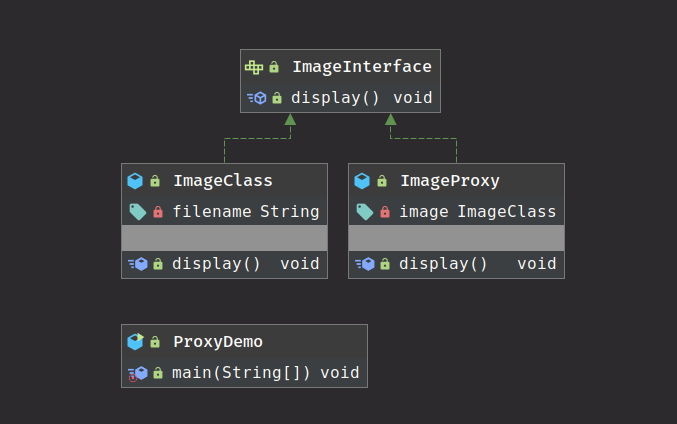
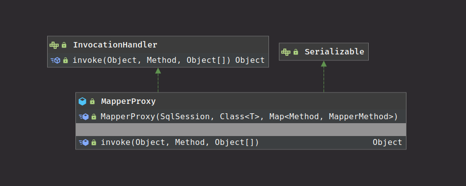

代理类提供其他类的对象，通过向外界提供功能接口以控制对这个对象的代理访问。

---

优点：

- 可以隐藏被代理类的具体实现
- 实现解耦，不修改被代理类

[TOC]


# 静态代理

## 小例子

```java
public interface ImageInterface {

    void display();
}
```

```java
public class ImageClass implements ImageInterface {

    private String filename;

    @Override
    public void display() {
        System.out.println("display");
    }
}
```

代理类实现接口

```java
public class ImageProxy implements ImageInterface {

    private ImageClass image;

    @Override
    public void display() {
        if (image == null) {
            image = new ImageClass();
        }
        image.display();
    }
}
```

通过代理类来获取Image的对象

```java
public class ProxyDemo {

    public static void main(String[] args) {
        ImageInterface image = new ImageProxy();
        image.display();
    }
}
```




## AspectJ

AspectJ在编译期间，就可以生成代理类

---

静态代理的缺点：

- 如果需要被代理的类有很多，那我们需要对每一个类都进行代理，当接口增加一个方法，那所有代理类也要相应增加方法

# SpringAOP用到的动态代理

上面的小例子是静态代理，动态代理则是在程序运行时动态生成代理

- 对于实现了接口的类，可以用“JDK动态代理”来实现代理

- 对于没有实现接口的类，则需要用到Cglib

## JDK动态代理

JVM可以在运行期间，根据反射等机制动态生成.class文件，这样就相当于在运行中动态创建类

### InvocationHandler

JVM可以动态生成需要被代理的类的代理类，但代理类总不能实现接口的所有方法吧，这就涉及到了InvocationHandler

InvocationHandler负责管理所有的动态生成代理的触发动作，接口只有一个invoke方法

无论调用代理对象的哪一个方法，都相当于在调用invocationHandler的invoke方法

```java
// proxy 代理类代理的真实对象
// method 调用的真实对象的Method对象
// args 真实方法的参数
// return 真实方法的返回值
public Object invoke(Object proxy, Method method, Object[] args)
        throws Throwable;
```

每一个代理类都要实现invoke方法

例子：

```java
public interface ImageInterface {

    void display(String name);

    void uselessMethod();
}
```

接口多了一个我们不希望被代理的方法

```java
public class ImageClass implements ImageInterface {

    private String filename;

    @Override
    public void display(String name) {
        System.out.println("display " + name);
    }

    @Override
    public void uselessMethod() {
        System.out.println("uselessMethod");
    }
}
```

```java
public class ImageJdkDynamicProxyInvocationHandler implements InvocationHandler {

    private ImageInterface image;

    public ImageJdkDynamicProxyInvocationHandler(ImageInterface image) {
        this.image = image;
    }

    @Override
    public Object invoke(Object proxy, Method method, Object[] args) throws Throwable {
        System.out.println("prepare invoke");
        System.out.println("method: " + method.toString());
        System.out.println("args: " + Arrays.toString(args));
        return method.invoke(image, args);
    }
}
```

覆盖invoke方法，返回代理方法的返回值

其中Method#invoke利用了Java的反射机制

```java
public class JdkDynamicProxyDemo {

    public static void main(String[] args) {
        String proxyName = "JdkDynamicProxy";
        // 需要被代理的类
        ImageInterface image = new ImageClass();
        // 需要被代理的类的classloader
        ClassLoader classLoader = image.getClass().getClassLoader();
        // 需要被代理的类实现的所有接口
        Class<?>[] interfaces = image.getClass().getInterfaces();
        // 触发管理器
        ImageJdkDynamicProxyInvocationHandler invocationHandler =
            new ImageJdkDynamicProxyInvocationHandler(image);
        // JDK在内存中动态创建.class字节码
        Object object = Proxy.newProxyInstance(classLoader, interfaces, invocationHandler);
        // 通过代理调用
        ((ImageInterface) object).display(proxyName);
        // ---
        // 生成代理类字节码
        byte[] bytes = ProxyGenerator
            .generateProxyClass(proxyName, image.getClass().getInterfaces());
        // 写入到文件
        try (FileOutputStream outputStream = new FileOutputStream(
            image.getClass().getResource(".").getPath() + proxyName + ".class")) {
            outputStream.write(bytes);
            outputStream.flush();
        } catch (IOException e) {
            e.printStackTrace();
        }
    }
}
// prepare invoke
// method: public abstract void org.humingk.test.proxy.ImageInterface.display(java.lang.String)
// args: [JdkDynamicProxy]
// display JdkDynamicProxy
```

我们一般new一个对象然后调用它的成员方法，但这里，JDK动态代理用到了Proxy的newProxyInstance方法，用于生成代理实例

生成的JdkDynamicProxy字节码文件：

```java
//
// Source code recreated from a .class file by IntelliJ IDEA
// (powered by Fernflower decompiler)
//

import java.lang.reflect.InvocationHandler;
import java.lang.reflect.Method;
import java.lang.reflect.Proxy;
import java.lang.reflect.UndeclaredThrowableException;
import org.humingk.test.proxy.ImageInterface;

public final class JdkDynamicProxy extends Proxy implements ImageInterface {
    private static Method m1;
    private static Method m4;
    private static Method m2;
    private static Method m3;
    private static Method m0;

    public JdkDynamicProxy(InvocationHandler var1) throws  {
        super(var1);
    }

    public final boolean equals(Object var1) throws  {
        try {
            return (Boolean)super.h.invoke(this, m1, new Object[]{var1});
        } catch (RuntimeException | Error var3) {
            throw var3;
        } catch (Throwable var4) {
            throw new UndeclaredThrowableException(var4);
        }
    }
// image中的uselessMethod方法
    public final void uselessMethod() throws  {
        try {
            // 调用的是invoke方法
            super.h.invoke(this, m4, (Object[])null);
        } catch (RuntimeException | Error var2) {
            throw var2;
        } catch (Throwable var3) {
            throw new UndeclaredThrowableException(var3);
        }
    }

    public final String toString() throws  {
        try {
            return (String)super.h.invoke(this, m2, (Object[])null);
        } catch (RuntimeException | Error var2) {
            throw var2;
        } catch (Throwable var3) {
            throw new UndeclaredThrowableException(var3);
        }
    }
// image中的display方法
    public final void display(String var1) throws  {
        try {
            super.h.invoke(this, m3, new Object[]{var1});
        } catch (RuntimeException | Error var3) {
            throw var3;
        } catch (Throwable var4) {
            throw new UndeclaredThrowableException(var4);
        }
    }

    public final int hashCode() throws  {
        try {
            return (Integer)super.h.invoke(this, m0, (Object[])null);
        } catch (RuntimeException | Error var2) {
            throw var2;
        } catch (Throwable var3) {
            throw new UndeclaredThrowableException(var3);
        }
    }

    static {
        try {
            m1 = Class.forName("java.lang.Object").getMethod("equals", Class.forName("java.lang.Object"));
            m4 = Class.forName("org.humingk.test.proxy.ImageInterface").getMethod("uselessMethod");
            m2 = Class.forName("java.lang.Object").getMethod("toString");
            m3 = Class.forName("org.humingk.test.proxy.ImageInterface").getMethod("display", Class.forName("java.lang.String"));
            m0 = Class.forName("java.lang.Object").getMethod("hashCode");
        } catch (NoSuchMethodException var2) {
            throw new NoSuchMethodError(var2.getMessage());
        } catch (ClassNotFoundException var3) {
            throw new NoClassDefFoundError(var3.getMessage());
        }
    }
}
```

## Cglib动态代理

实现MethodInterceptor接口：

```java
public class ImageCglibDynamicProxyMethodInterceptor implements MethodInterceptor {

    @Override
    public Object intercept(Object o, Method method, Object[] objects, MethodProxy methodProxy)
        throws Throwable {
        System.out.println("prepare intercept");
        System.out.println("method: " + method.toString());
        System.out.println("objects: " + Arrays.toString(objects));
        return methodProxy.invokeSuper(o, objects);
    }
}
```

```java
public class CglibDynamicProxyDemo {

    public static void main(String[] args) {
        // 需要被代理的类
        ImageInterface image = new ImageClass();
        // 类似invocationHandler
        ImageCglibDynamicProxyMethodInterceptor methodInterceptor = new ImageCglibDynamicProxyMethodInterceptor();
        // cglib加强器
        Enhancer enhancer = new Enhancer();
        // 动态代理image
        enhancer.setSuperclass(image.getClass());
        // image所有方法会调用回调方法，回调方法会通过intercept拦截
        enhancer.setCallback(methodInterceptor);
        // 代理调用
        ((ImageInterface) enhancer.create()).display("CglibDynamicProxy");
    }
}
// prepare intercept
// method: public void org.humingk.test.proxy.ImageClass.display(java.lang.String)
// objects: [CglibDynamicProxy]
// display CglibDynamicProxy
```


# Mybatis用到的动态代理

## Mapper

我们只需要编写Mapper接口，便能运行对应的SQL语句，Mybatis通过代理实现



MapperProxy实现了InvocationHandler接口

### MapperRegistry#getMapper

```java
  @SuppressWarnings("unchecked")
  public <T> T getMapper(Class<T> type, SqlSession sqlSession) {
    final MapperProxyFactory<T> mapperProxyFactory = (MapperProxyFactory<T>) knownMappers.get(type);
    if (mapperProxyFactory == null) {
      throw new BindingException("Type " + type + " is not known to the MapperRegistry.");
    }
    try {
      return mapperProxyFactory.newInstance(sqlSession);
    } catch (Exception e) {
      throw new BindingException("Error getting mapper instance. Cause: " + e, e);
    }
  }
```

我们通过MapperRegistry来注册Mapper接口

getMapper方法会调用MapperProxyFactory的newInstance方法来获取动态的代理对象

### MapperProxy#invoke

```java
  @Override
  public Object invoke(Object proxy, Method method, Object[] args) throws Throwable {
    try {
      if (Object.class.equals(method.getDeclaringClass())) {
          // 执行被代理的真实类的对应的方法
        return method.invoke(this, args);
      } else if (isDefaultMethod(method)) {
        return invokeDefaultMethod(proxy, method, args);
      }
    } catch (Throwable t) {
      throw ExceptionUtil.unwrapThrowable(t);
    }
    final MapperMethod mapperMethod = cachedMapperMethod(method);
    return mapperMethod.execute(sqlSession, args);
  }
```

### MapperProxyFactory

```java
/**
 * @author Lasse Voss
 */
public class MapperProxyFactory<T> {

  private final Class<T> mapperInterface;
  private final Map<Method, MapperMethod> methodCache = new ConcurrentHashMap<>();

  public MapperProxyFactory(Class<T> mapperInterface) {
    this.mapperInterface = mapperInterface;
  }

  public Class<T> getMapperInterface() {
    return mapperInterface;
  }

  public Map<Method, MapperMethod> getMethodCache() {
    return methodCache;
  }

  @SuppressWarnings("unchecked")
  protected T newInstance(MapperProxy<T> mapperProxy) {
      // 可以看到，和上面JDK动态代理例子一样，通过Proxy的newProxyInstance方法生成实例
    return (T) Proxy.newProxyInstance(mapperInterface.getClassLoader(), new Class[] { mapperInterface }, mapperProxy);
  }

  public T newInstance(SqlSession sqlSession) {
    final MapperProxy<T> mapperProxy = new MapperProxy<>(sqlSession, mapperInterface, methodCache);
    return newInstance(mapperProxy);
  }

}
```

MapperProxyFactory就是一个使用了工厂模式的代理工厂，可以生产代理mapper对象


